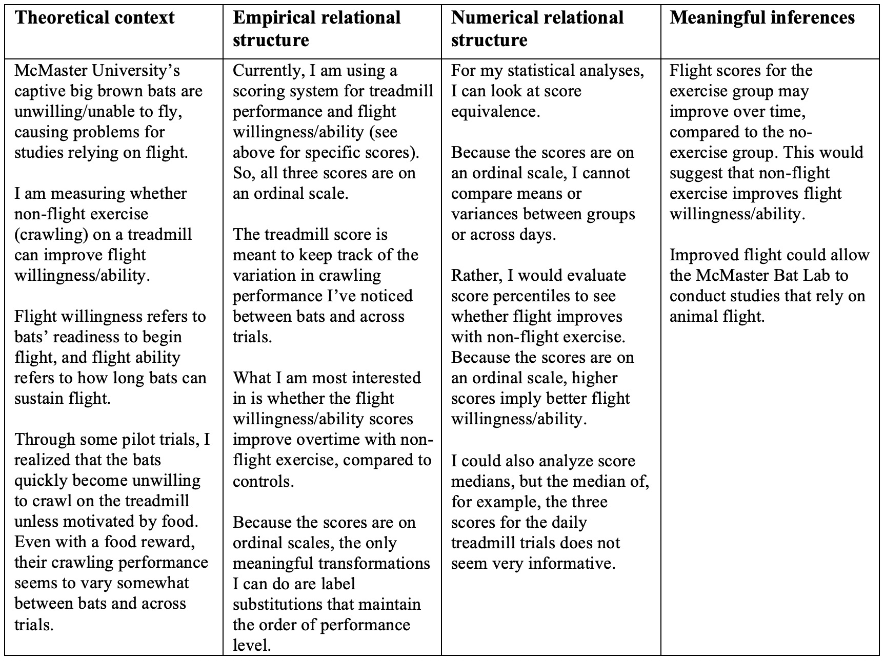
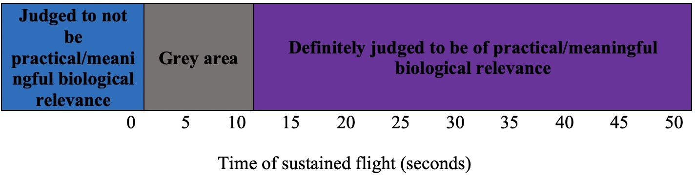

```{r setup, include=FALSE}
knitr::opts_chunk$set(echo = TRUE)
```

## My background
As a member of the McMaster Bat Lab, I am accustomed to our bats increasing in mass and decreasing in flight willingness/ability upon capture. Yet, I still underestimated and was surprised with how unwilling they would be to fly in my original master's project, which required just a couple laps at a time (at most). The project didn’t work because even after weeks of attempting to fly them, most of them couldn’t (or wouldn’t). In fact, most would just flop to the ground. 


After this, I came up with an idea to test whether exercising our captive bats through crawling (which they can do) might improve their flight (which, apparently, they can’t do well). I know that they crawl daily to eat because their food is always next to the wall, but not where they roost. Based on my experience in the lab, I know that they crawl to their food, rather than fly to it.

I have been using a mouse treadmill to exercise a group of bats and have been comparing their flight willingness/ability to another group that is not being exercised on the treadmill. I’m currently in the first round of data collection, which I planned to be an exploration of what works and what doesn’t. Throughout this, I have been thinking about ways to improve the experimental methods and statistical analyses.

## Data collected so far 
```{r, echo = TRUE} 
#These files are created by the 'exercise_data.R' script
exercise_data <- readRDS(file="treadmill_exercise.RDS")
flight_data <- readRDS(file="flights.RDS")
```
Because these data are still being collected, I am providing partial data sets and I haven't really done data cleaning. 

I am also recording daily bat masses, but I am not including it for the purposes of this assignment. 

```{r, echo = TRUE} 
summary(exercise_data)
```
These are the treadmill exercise data. Bat_ID is the animal identification; date is the date of data collection; Score_1, Score_2, Score_3 refer to the performance score allotted to the three treadmill trials completed daily.

**Treadmill performance scores**

1: Bat sat against rod, did not attempt to crawl

2: Bat sat against rod for majority of trial, attempted to crawl a few times, but was not very motivated

3: Bat sat against rod for some time during trial, but was motivated and crawled majority of the time

4: Bat crawled for the full trial, did not sit against rod for longer than it took to eat mealworm

```{r, echo = TRUE} 
summary(flight_data)
```
These are the flight data for the treatment and control groups. Bat_ID and date refer to the same things; Score_Flight1 to Score_Flight5 refer to the performance score allotted to the five flight trials that each bat completes every three days. Willingness_Flight 1 to Willingness_Flight5 refer to the willingness score allotted for the same flights.  

**Flight performance scores**

0: Bat did not complete trial (would not fly after 3 minutes)

1: Bat "flopped" to ground, did not reach opposite wall

2: Bat landed on opposite wall, below half height

3: Bat landed on opposite wall, above half height

4: Bat flew 1 to 2 laps

5: Bat flew 3 or more laps

6: Bat sustained flight for over 1 minute

**Flight willingness scores**

0: Bat did not complete trial (would not fly after 3 minutes)

1: Bat was unwilling to fly, took 3 or more "shakes" to take off

2: Bat was somewhat willing to fly, took 1 or 2 "shakes" to take off

3: Bat was willing to fly, took off within 10 seconds without "shake"

## 1. Measurment based on current design
**A.**

**B.**
As described in the above table, the inferences I can make from my data are limited due to the ordinal scales. I cannot analyze means or variances, only medians and percentiles. Essentially, I can evaluate the equivalence of i. treadmill performance and ii. flight willingness/ability performance.

## Potential measurement ##


I mentioned that I am treating this round of data collection as an exploration of the best methods for this project. As such, I am planning to collect more data with different captive bats, hopefully with a larger sample size (colony size permitting).


I have been considering ways to change to a scale type containing more information. Specifically, I would like to use a ratio scale for flight ability. It is tricky to time our bat's flights because of their tendency to "flop" to the floor (I have tried in the past, and usually by the time I start the timer, the bat is on the floor). Regardless, I am considering starting a timer when the bat takes off and stopping the timer when the bat lands. If the bat "flops" to the ground immediately, I will consider it as "no flight" (i.e. 0 seconds). I feel comfortable considering it as "no flight", because even though the bat will flap its wings a few times, this behaviour is not conducive to the research that I and other bat biologists hope to do. 

On the other hand, if the bat does not immediately "flop" to the ground, I can record its flight time. With this continuous ratio scale, I could meaningfully compare flight times through differences and ratios. I would be interested in whether mean flight times of the treatment and control groups are greater than 0, and whether the mean flight time of the treatment group is greater than the control group. If the means do differ, I can evaluate *how much* they differ.


I think it would be more valuable to consider this flight ability continuous ratio scale for the remainder of the assignment, rather than my current scoring methods. 

## 2. Effect sizes and meaningful magnitudes ##

**A.** 
I have not come across other research like this because bats refusing to fly isn’t a problem for most of my field. Most bat researchers work either directly in the field, or capture bats and study them right away, rather than having them in captivity long-term. So, I have not found a historical precedent for the best measure of effect size in my field.

Instead, I will rely on the historical precedent set by statisticians. So, I would use *Hedge's g* for my measure of effect size. 

Like *Cohen's d*, *Hedge's g* estimates the magnitude of an effect. In this case, I would evaluate the magnitude of the effect of non-flight exercise (crawling) on flight ability. *Hedge's g* is better for small sample sizes than *Cohen's d*. For sample sizes less than 10 per group, *Cohen's d* creates a relatively large upward bias of effect size, and this bias is corrected in the *Hedge's g* calculation (Nakagawa & Cuthill, 2007). I know that I will have less than 10 bats per group because we don't have enough bats currently in captivity. 

**B.**
I would scale by the weighted pooled standard deviation, which takes biological variation into account and is weighted using the sample sizes of each group to reduce the upward bias mentioned above (Taylor & Alanazi, 2023).

**C.**
As mentioned, a benefit of using *Hedge's g* is that it accounts for the small sample size I will have and reduces the upward bias. 


Though I have not seen studies testing the effects of non-flight exercise in bats, I know that the benefits of exercise have been studied in humans and animals. The strength of calculating *Hedge's g* is that it allows me to compare effects across studies. 
I can also communicate the practical significance of my results, so that future studies can compare to my work. 


A potential problem with calculating *Hedge's g*, which scales using weighted pooled standard deviation, is called the "rubber ruler effect". This refers to the fact that the pooled standard deviation  is based on the sample data, and so will vary across samples. It is important to report my standard deviation and to check standard deviations on the same scale. 

Furthermore, a potential negative of *Hedge's g* is that there isn't a definitive answer for what constitutes small, medium, and large effects. Although there are guidelines (Cohen, 1992), we shouldn't interpret *Hedge's g* with such rigidity. 

**D.**
Again, I haven't seen research examining the same thing I am. However, I can rely on animal behaviour reported in bat studies conducted in laboratories. For some studies, the bats had to sustain flight for several minutes, such as in foraging experiments (Chiu et al., 2010; Wright et al., 2011). For others (e.g. obstacle avoidance, echolocation call recordings), it has been sufficient for bats to fly to the room's opposite wall (Sändig et al., 2014; Barchi et al., 2013).  


I've seen newly caught big brown bats sustain flight for 10 minutes at a time. Realistically, I know I can't expect our bats to do this. As I mentioned, my own original study required the bats to complete a few laps of the room. Taking everything into account, I can create the following Figure:


This displays my measure of effect (how long the bat sustains flight, in seconds). I haven't included negative numbers on the scale because there is no "negative flight". So, it begins at 0 seconds, which is not practical/meaningful because it means the bat did not fly. 5 to 10 seconds are in the grey area, because while the bat could likely reach the opposite wall in that time, it wouldn't really allow for studies involving navigation or foraging. Finally, 15 seconds and higher are in the practical/meaningful section. This would mean that the bat completes multiple laps around the room, and trials could involve more than just the bat landing on the opposite wall. 

**E.**


1. We are confident (or almost confident) there is a positive effect, but it is not judged to be practical/meaningful. It is a very precise estimate (95% confidence intervals are narrow). 


2. We are not confident there is a positive effect. It is not a precise estimate, ranging across not practical/meaningful, the grey area, and judged to be practical/meaningful. The estimate does not have much precision. 


3. We are confident (or almost confident) there is a positive effect, and the effect is judged ot be practical/meaningful.


4. We are confident (or almost confident) there is a positive effect, but the range included values in the grey area and judged to be practical/meaningful area, so we are not confident the effect is practical/meaningful. 


5. We are confident (or almost confident) there is a positive effect, but the range included values in the not practical/meaningful area, the grey area and the judged to be practical/meaningful area, so we are not confident the effect is practical/meaningful. 


6. We are confident (or almost confident) there is a positive effect, but we are (almost) confident that it is not practical/meaningful. The estimate is relatively precise.


7. We are not confident there is a positive effect, but we are  confident (or almost confident) that the effect is judged to not be practical/meaningful. The estimate is relatively precise.


Based on traditional NHST, 1, 3, 4, 5, 6 would all be judged as "significant". 2 and 7 would not be because the estimates cross 0. However, NHST does not show the full story. 

